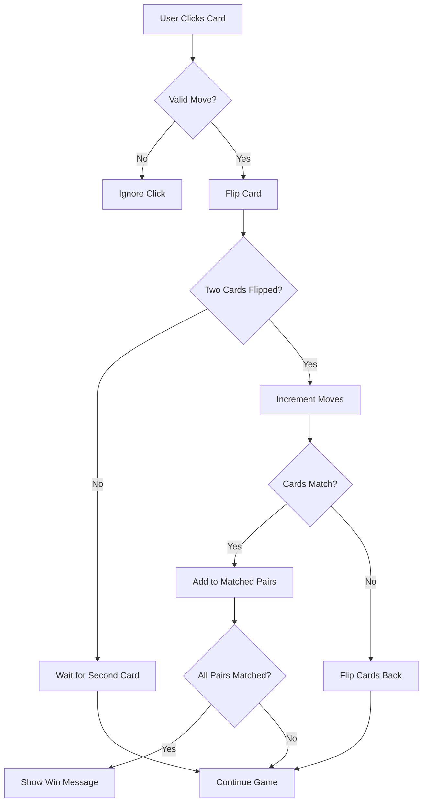

# 🎮 Memory Card Game - Technical Design Document

## 📋 **Project Overview**

### **Project Name:** Memory Card Game
### **Technology Stack:** React + Vite + CSS3
### **Version:** 1.0.0
### **Last Updated:** December 2024
### **Repository:** [memory-card](https://github.com/your-username/memory-card)

---

## 🏗️ **Architecture Overview**

### **High-Level Architecture**
```
┌─────────────────────────────────────────────────────────────┐
│                    Memory Card Game                         │
├─────────────────────────────────────────────────────────────┤
│  React App (App.jsx)                                        │
│  ├── Game State Management                                  │
│  ├── Card Grid Component                                    │
│  ├── Header Component                                       │
│  └── Win Message Component                                  │
├─────────────────────────────────────────────────────────────┤
│  Styling Layer (App.css)                                    │
│  ├── Responsive Grid Layout                                 │
│  ├── 3D Card Animations                                     │
│  ├── Glassmorphism Effects                                  │
│  └── Mobile-First Design                                    │
└─────────────────────────────────────────────────────────────┘
```

### **Technology Stack Details**
- **Frontend Framework:** React 18.x
- **Build Tool:** Vite 5.x
- **Styling:** CSS3 with modern features
- **Development Server:** Vite Dev Server
- **Package Manager:** npm

---

## 🎯 **Core Features**

### **1. Game Mechanics**
- **Card Matching:** 16 cards (8 pairs) with emoji symbols
- **Random Shuffling:** Cards shuffle on each new game
- **Turn Management:** Two cards flipped per turn
- **Match Detection:** Automatic pair identification
- **Win Condition:** All pairs matched
- **Move Counter:** Track number of moves made

### **2. User Interface**
- **Responsive Design:** Mobile-first approach
- **3D Card Animations:** Smooth flip transitions
- **Visual Feedback:** Hover effects, match celebrations
- **Game Statistics:** Move counter and reset functionality
- **Win Celebration:** Animated success message

### **3. Accessibility Features**
- **Keyboard Navigation:** Tab and Enter key support
- **Focus Indicators:** Clear visual focus states
- **Color Contrast:** WCAG AA compliant
- **Screen Reader Support:** Semantic HTML structure

---

## 📁 **File Structure**

```
memory-card/
├── src/
│   ├── App.jsx              # Main game component
│   ├── App.css              # Game styling
│   ├── index.css            # Global styles
│   ├── main.jsx             # React entry point
│   └── assets/
│       └── react.svg        # React logo
├── public/
│   └── vite.svg            # Vite logo
├── index.html              # HTML template
├── package.json            # Dependencies
├── vite.config.js          # Vite configuration
├── README.md               # Project documentation
└── TECHNICAL_DESIGN.md     # This document
```

---

## 🔧 **Technical Implementation**

### **1. State Management**

```javascript
// Core Game States
const [cards, setCards] = useState([])           // Card data array
const [flippedCards, setFlippedCards] = useState([])  // Currently flipped cards
const [matchedPairs, setMatchedPairs] = useState([])  // Successfully matched cards
const [moves, setMoves] = useState(0)            // Game move counter
const [gameWon, setGameWon] = useState(false)    // Win condition flag
```

**State Flow:**
```
Initialization → Card Shuffle → Game Play → Match Detection → Win Check
```

### **2. Card Data Structure**

```javascript
{
  id: number,           // Unique card identifier
  emoji: string,        // Card symbol (🐶, 🐱, etc.)
  isFlipped: boolean,   // Current flip state
  isMatched: boolean    // Match status
}
```

### **3. Game Logic Flow**



### **4. Key Functions**

#### **Game Initialization**
```javascript
const initializeGame = () => {
  const shuffledCards = [...cardEmojis, ...cardEmojis]
    .sort(() => Math.random() - 0.5)
    .map((emoji, index) => ({
      id: index,
      emoji,
      isFlipped: false,
      isMatched: false
    }))
  
  setCards(shuffledCards)
  setFlippedCards([])
  setMatchedPairs([])
  setMoves(0)
  setGameWon(false)
}
```

#### **Card Click Handler**
```javascript
const handleCardClick = (cardId) => {
  if (flippedCards.length === 2 || 
      flippedCards.includes(cardId) || 
      matchedPairs.includes(cardId)) {
    return
  }

  const newFlippedCards = [...flippedCards, cardId]
  setFlippedCards(newFlippedCards)

  if (newFlippedCards.length === 2) {
    setMoves(prev => prev + 1)
    checkForMatch(newFlippedCards)
  }
}
```

---

## 🎨 **CSS Architecture**

### **1. Design System**

#### **Color Palette:**
```css
/* Primary Gradients */
--gradient-primary: linear-gradient(135deg, #667eea 0%, #764ba2 100%);
--gradient-secondary: linear-gradient(135deg, #f093fb 0%, #f5576c 100%);
--gradient-success: linear-gradient(135deg, #4facfe 0%, #00f2fe 100%);

/* Typography Colors */
--text-primary: #2c3e50;
--text-light: rgba(255, 255, 255, 0.87);

/* Background Colors */
--bg-primary: #242424;
--bg-light: rgba(255, 255, 255, 0.95);
```

#### **Spacing Scale:**
```css
/* Consistent spacing units */
--spacing-xs: 8px;
--spacing-sm: 15px;
--spacing-md: 20px;
--spacing-lg: 30px;
--spacing-xl: 40px;
```

#### **Typography Scale:**
```css
/* Font sizes */
--font-xs: 0.875rem;    /* 14px */
--font-sm: 1rem;        /* 16px */
--font-md: 1.125rem;    /* 18px */
--font-lg: 1.5rem;      /* 24px */
--font-xl: 2rem;        /* 32px */
--font-2xl: 2.5rem;     /* 40px */
```

### **2. Layout System**

#### **Grid Layout:**
```css
.cards-grid {
  display: grid;
  grid-template-columns: repeat(4, 1fr);  /* Desktop: 4 columns */
  gap: 15px;
  max-width: 600px;
  margin: 0 auto;
}
```

#### **Flexbox Layout:**
```css
.app {
  display: flex;
  justify-content: center;
  align-items: center;
  min-height: 100vh;
}
```

### **3. Animation System**

#### **3D Card Flip:**
```css
.card-inner {
  position: relative;
  width: 100%;
  height: 100%;
  text-align: center;
  transition: transform 0.6s;
  transform-style: preserve-3d;
  border-radius: 15px;
}

.memory-card.flipped .card-inner {
  transform: rotateY(180deg);
}
```

#### **Keyframe Animations:**
```css
@keyframes matchedPulse {
  0% { transform: rotateY(180deg) scale(1); }
  50% { transform: rotateY(180deg) scale(1.1); }
  100% { transform: rotateY(180deg) scale(1); }
}

@keyframes cardAppear {
  from {
    opacity: 0;
    transform: scale(0.8) rotateY(180deg);
  }
  to {
    opacity: 1;
    transform: scale(1) rotateY(0deg);
  }
}
```

### **4. Glassmorphism Effects**

```css
.game-container {
  background: rgba(255, 255, 255, 0.95);
  backdrop-filter: blur(10px);
  border-radius: 20px;
  box-shadow: 0 20px 40px rgba(0, 0, 0, 0.1);
}
```

---

## 📱 **Responsive Design Strategy**

### **Breakpoint System:**
```css
/* Mobile First Approach */
/* Base styles for mobile (320px+) */

/* Tablet */
@media (min-width: 768px) {
  .cards-grid {
    grid-template-columns: repeat(3, 1fr);
  }
}

/* Desktop */
@media (min-width: 1024px) {
  .cards-grid {
    grid-template-columns: repeat(4, 1fr);
  }
}
```

### **Adaptive Components:**

#### **Grid Layout:**
- **Mobile (320px+):** 2 columns
- **Tablet (768px+):** 3 columns  
- **Desktop (1024px+):** 4 columns

#### **Typography Scaling:**
```css
.game-title {
  font-size: 1.5rem;  /* Mobile */
}

@media (min-width: 768px) {
  .game-title {
    font-size: 2rem;  /* Tablet */
  }
}

@media (min-width: 1024px) {
  .game-title {
    font-size: 2.5rem;  /* Desktop */
  }
}
```

#### **Touch Targets:**
- **Minimum size:** 44px × 44px
- **Card spacing:** 8px on mobile, 15px on desktop
- **Button padding:** 10px on mobile, 15px on desktop

---

## ⚡ **Performance Considerations**

### **1. Animation Performance**
- **Hardware Acceleration:** Using `transform` and `opacity`
- **GPU Rendering:** `backface-visibility: hidden`
- **Smooth Transitions:** 60fps animations with `transition`
- **Will-change:** Optimized for frequently animated properties

### **2. Memory Management**
- **Efficient State Updates:** Minimal re-renders
- **Event Handling:** Debounced click events
- **Cleanup:** Proper useEffect cleanup
- **Memoization:** React.memo for expensive components

### **3. Loading Optimization**
- **Staggered Animations:** Progressive card appearance
- **Lazy Loading:** Components load as needed
- **Bundle Size:** Minimal dependencies
- **Code Splitting:** Route-based splitting if needed

### **4. Rendering Performance**
```javascript
// Optimized card rendering
const MemoryCard = React.memo(({ card, onClick, isFlipped, isMatched }) => {
  return (
    <div 
      className={`memory-card ${isFlipped ? 'flipped' : ''} ${isMatched ? 'matched' : ''}`}
      onClick={() => onClick(card.id)}
    >
      {/* Card content */}
    </div>
  )
})
```

---

## 🧪 **Testing Strategy**

### **1. Functional Testing**
- **Game Logic:** Card matching, win conditions
- **User Interactions:** Click handling, state updates
- **Edge Cases:** Invalid moves, rapid clicking
- **State Management:** Proper state transitions

### **2. Visual Testing**
- **Responsive Design:** Cross-device compatibility
- **Animation Smoothness:** Performance validation
- **Accessibility:** Color contrast, focus indicators
- **Cross-browser:** Chrome, Firefox, Safari, Edge

### **3. Performance Testing**
- **Load Time:** < 2 seconds
- **Animation FPS:** 60fps
- **Memory Usage:** < 50MB
- **Bundle Size:** < 500KB

### **4. Accessibility Testing**
- **Screen Readers:** NVDA, JAWS, VoiceOver
- **Keyboard Navigation:** Tab, Enter, Space
- **Color Contrast:** WCAG AA compliance
- **Focus Management:** Visible focus indicators

---

## 🔒 **Security Considerations**

### **1. Input Validation**
- **Click Handling:** Prevent rapid-fire clicks
- **State Protection:** Immutable state updates
- **Data Integrity:** Valid card operations only
- **XSS Prevention:** No user input processing

### **2. Code Security**
- **No External Dependencies:** Self-contained game logic
- **Secure Practices:** Modern React patterns
- **Content Security Policy:** Restricted resource loading
- **HTTPS Enforcement:** Secure connections

---

## 🚀 **Deployment Strategy**

### **1. Build Process**
```bash
# Development
npm run dev          # Start development server

# Production build
npm run build        # Create production build
npm run preview      # Preview production build

# Testing
npm run test         # Run test suite
npm run lint         # Code linting
```

### **2. Build Configuration**
```javascript
// vite.config.js
export default defineConfig({
  plugins: [react()],
  build: {
    outDir: 'dist',
    sourcemap: false,
    minify: 'terser',
    rollupOptions: {
      output: {
        manualChunks: undefined
      }
    }
  }
})
```

### **3. Hosting Options**
- **Static Hosting:** Netlify, Vercel, GitHub Pages
- **CDN Distribution:** Global content delivery
- **HTTPS Enforcement:** Secure connections
- **Cache Strategy:** Long-term caching for static assets

### **4. Environment Configuration**
```bash
# .env.production
VITE_APP_TITLE=Memory Card Game
VITE_APP_VERSION=1.0.0
```

---

## 📈 **Future Enhancements**

### **Phase 1: Core Features** ✅
- [x] Basic game mechanics
- [x] Responsive design
- [x] 3D animations
- [x] Win condition detection

### **Phase 2: Advanced Features** 🔄
- [ ] Timer functionality
- [ ] Score tracking with localStorage
- [ ] Multiple difficulty levels
- [ ] Sound effects and audio feedback
- [ ] Undo/Redo functionality

### **Phase 3: Social Features** 📋
- [ ] Leaderboards with backend integration
- [ ] Multiplayer support (WebRTC)
- [ ] Share results on social media
- [ ] Custom card themes and skins
- [ ] User accounts and progress tracking

### **Phase 4: Advanced UI/UX** 📋
- [ ] Dark/Light theme toggle
- [ ] Accessibility improvements
- [ ] PWA (Progressive Web App) features
- [ ] Offline support
- [ ] Performance optimizations

---

## 📊 **Technical Specifications**

### **Performance Targets:**
- **Load Time:** < 2 seconds
- **Animation FPS:** 60fps
- **Memory Usage:** < 50MB
- **Bundle Size:** < 500KB
- **First Contentful Paint:** < 1.5s
- **Largest Contentful Paint:** < 2.5s

### **Browser Support:**
- **Chrome:** 90+
- **Firefox:** 88+
- **Safari:** 14+
- **Edge:** 90+
- **Mobile Safari:** 14+
- **Chrome Mobile:** 90+

### **Device Support:**
- **Desktop:** 1024px+
- **Tablet:** 768px - 1023px
- **Mobile:** 320px - 767px
- **Touch Devices:** iOS, Android

### **Accessibility Standards:**
- **WCAG 2.1:** AA compliance
- **Section 508:** Compliance
- **ARIA Labels:** Proper semantic markup
- **Keyboard Navigation:** Full support

---

## 📝 **Documentation Standards**

### **Code Comments:**
```javascript
/**
 * Handles card click events and manages game state
 * @param {number} cardId - The ID of the clicked card
 * @returns {void}
 */
const handleCardClick = (cardId) => {
  // Implementation details
}
```

### **CSS Documentation:**
```css
/* Card flip animation with 3D transform
 * Uses hardware acceleration for smooth performance
 * Duration: 600ms for natural feel
 */
.card-inner {
  transition: transform 0.6s;
  transform-style: preserve-3d;
}
```

### **Version Control:**
- **Commit Messages:** Conventional Commits format
- **Branch Strategy:** Git Flow
- **Code Review:** Pull request process
- **Release Tags:** Semantic versioning

### **API Documentation:**
- **Component Props:** TypeScript interfaces
- **State Management:** State shape documentation
- **Event Handlers:** Event parameter types
- **CSS Classes:** Component relationship mapping

---

## 🔧 **Development Workflow**

### **1. Setup Instructions**
```bash
# Clone repository
git clone https://github.com/your-username/memory-card.git
cd memory-card

# Install dependencies
npm install

# Start development server
npm run dev
```

### **2. Development Commands**
```bash
npm run dev          # Start development server
npm run build        # Build for production
npm run preview      # Preview production build
npm run lint         # Run ESLint
npm run format       # Format code with Prettier
```

### **3. Code Quality Tools**
- **ESLint:** Code linting and style enforcement
- **Prettier:** Code formatting
- **Husky:** Git hooks for pre-commit checks
- **Lint-staged:** Run linters on staged files

---

## 📞 **Support and Maintenance**

### **Contact Information:**
- **Developer:** [Your Name]
- **Email:** [your.email@example.com]
- **GitHub:** [github.com/your-username]

### **Issue Reporting:**
- **GitHub Issues:** Bug reports and feature requests
- **Documentation:** Keep this document updated
- **Changelog:** Track version changes

### **Maintenance Schedule:**
- **Weekly:** Dependency updates
- **Monthly:** Security audits
- **Quarterly:** Performance reviews
- **Annually:** Major feature updates

---

## 📄 **License Information**

### **License:** MIT License
### **Copyright:** 2024 [Your Name]
### **Permissions:** Commercial use, modification, distribution
### **Limitations:** No warranty, no liability

---

*This technical design document provides a comprehensive overview of the Memory Card Game project. It serves as a reference for development, maintenance, and future enhancements. Last updated: December 2024.* 