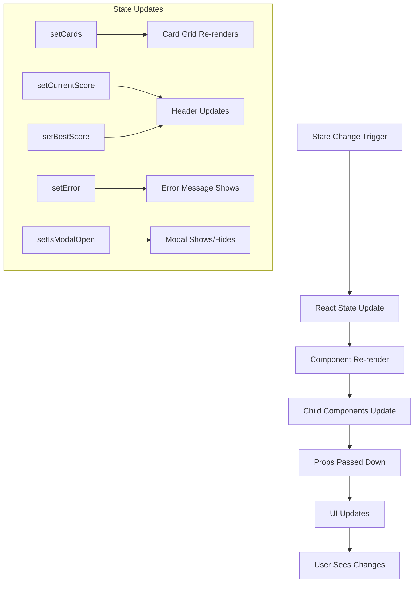

# 🏗️ Memory Card Game - Architecture & Dataflow

## 📋 **Project Overview**

### **Project Name:** Memory Card Game
### **Repository:** [thedeepak12/memory-card](https://github.com/thedeepak12/memory-card/tree/main/src)
### **Technology Stack:** React + Vite + Tailwind CSS

---

## 🏗️ **System Architecture**

### **High-Level Architecture**
```
┌─────────────────────────────────────────────────────────────┐
│                    Memory Card Game                         │
├─────────────────────────────────────────────────────────────┤
│  React Application Layer                                   │
│  ├── App Component (Main Container)                        │
│  ├── Header Component (Score Display)                      │
│  ├── GameBoard Component (Card Grid)                       │
│  ├── Modal Component (Win Dialog)                          │
│  └── Error Boundary (Error Handling)                       │
├─────────────────────────────────────────────────────────────┤
│  State Management Layer                                    │
│  ├── Game State (Cards, Score, Modal)                      │
│  ├── Card State (Flip, Match Status)                       │
│  └── UI State (Error, Loading)                             │
├─────────────────────────────────────────────────────────────┤
│  Styling Layer (Tailwind CSS)                              │
│  ├── Responsive Grid System                                │
│  ├── Animation System (3D Transforms)                      │
│  └── Component Styling                                     │
└─────────────────────────────────────────────────────────────┘
```

### **Component Architecture**
```
App Component
├── State Management
│   ├── cards: Card[]
│   ├── currentScore: number
│   ├── bestScore: number
│   ├── error: string
│   └── isModalOpen: boolean
├── Event Handlers
│   ├── initializeGame()
│   ├── handleCardClick()
│   ├── handleCloseModal()
│   └── handleRestartGame()
└── Child Components
    ├── Header (currentScore, bestScore)
    ├── GameBoard (cards, onClick)
    └── Modal (isOpen, onClose, onRestart)
```

### **Data Structures**

#### **Card Object**
```typescript
interface Card {
  id: number;           // Unique identifier
  emoji: string;        // Card symbol (🐶, 🐱, etc.)
  isFlipped: boolean;   // Current flip state
  isMatched: boolean;   // Match status
}
```

#### **Game State**
```typescript
interface GameState {
  cards: Card[];        // Array of 16 cards (8 pairs)
  currentScore: number; // Current game score
  bestScore: number;    // Best score achieved
  error: string;        // Error message
  isModalOpen: boolean; // Modal visibility
}
```

---

## 🔄 **Data Flow Architecture**

### **1. Application Initialization Flow**
```mermaid
graph TD
    A[App Mount] --> B[useEffect Trigger]
    B --> C[initializeGame()]
    C --> D[Create Card Emojis Array]
    D --> E[Duplicate Array for Pairs]
    E --> F[Shuffle Cards]
    F --> G[Map to Card Objects]
    G --> H[Set Initial State]
    H --> I[Reset Scores & Error]
    I --> J[Game Ready]
```

### **2. Card Interaction Flow**
```mermaid
graph TD
    A[User Clicks Card] --> B[handleCardClick(cardId)]
    B --> C{Valid Click?}
    C -->|No| D[Return Early]
    C -->|Yes| E[Find Card by ID]
    E --> F{Card Already Flipped/Matched?}
    F -->|Yes| D
    F -->|No| G[Check Flipped Cards Count]
    G --> H{Two Cards Already Flipped?}
    H -->|Yes| D
    H -->|No| I[Flip Card]
    I --> J[Update Cards State]
    J --> K{Two Cards Now Flipped?}
    K -->|No| L[Wait for Second Card]
    K -->|Yes| M[Increment Score]
    M --> N[Check for Match]
    N --> O{Emojis Match?}
    O -->|Yes| P[Mark Cards as Matched]
    O -->|No| Q[Flip Cards Back After Delay]
    P --> R{All Cards Matched?}
    R -->|Yes| S[Show Win Modal]
    R -->|No| T[Continue Game]
    Q --> T
    L --> T
    S --> U[Update Best Score]
    U --> V[Game Complete]
```

### **3. State Update Flow**


### **4. Error Handling Flow**
```mermaid
graph TD
    A[Error Occurs] --> B[Try-Catch Block]
    B --> C[setError(message)]
    C --> D[Error Component Renders]
    D --> E[User Sees Error Message]
    E --> F[Error Auto-Clears on Next Action]
    
    subgraph "Error Sources"
        G[Game Initialization] --> H[setError('Failed to initialize game')]
        I[Card Click Handler] --> J[setError('An error occurred during gameplay')]
        K[State Update Failure] --> L[setError('State update failed')]
    end
```

### **5. Modal Interaction Flow**
```mermaid
graph TD
    A[Game Won] --> B[setIsModalOpen(true)]
    B --> C[Modal Component Renders]
    C --> D[User Sees Win Message]
    D --> E{User Action}
    E -->|Close| F[handleCloseModal()]
    E -->|Restart| G[handleRestartGame()]
    F --> H[setIsModalOpen(false)]
    G --> I[initializeGame()]
    I --> J[setIsModalOpen(false)]
    H --> K[Modal Hidden]
    J --> K
    K --> L[Game State Reset]
```

---

## 📊 **Component Data Flow**

### **App → Header Component**
```
Props Flow:
App State: { currentScore, bestScore }
    ↓
Header Props: { currentScore, bestScore }
    ↓
Header Renders: Score Display
```

### **App → GameBoard Component**
```
Props Flow:
App State: { cards }
App Function: handleCardClick
    ↓
GameBoard Props: { cards, onClick }
    ↓
GameBoard Renders: Card Grid
    ↓
Card Click → onClick(cardId) → handleCardClick(cardId)
```

### **App → Modal Component**
```
Props Flow:
App State: { isModalOpen }
App Functions: { handleCloseModal, handleRestartGame }
    ↓
Modal Props: { isOpen, onClose, onRestart }
    ↓
Modal Renders: Win Dialog
    ↓
Button Click → onClose() / onRestart()
```

---

## 🔄 **Event Flow Architecture**

### **1. Game Initialization Event**
```
Event: Component Mount
├── Trigger: useEffect(() => {}, [])
├── Action: initializeGame()
├── Data Flow:
│   ├── Input: cardEmojis array
│   ├── Process: Shuffle and create card objects
│   └── Output: Updated game state
└── State Changes:
    ├── cards: [] → Card[]
    ├── currentScore: 0
    ├── bestScore: preserved
    ├── error: ''
    └── isModalOpen: false
```

### **2. Card Click Event**
```
Event: User Card Click
├── Trigger: onClick={handleCardClick}
├── Action: handleCardClick(cardId)
├── Data Flow:
│   ├── Input: cardId (number)
│   ├── Process: Validate and update card state
│   └── Output: Updated cards array
└── State Changes:
    ├── cards: Card[] → Card[] (with flipped/matched updates)
    ├── currentScore: number → number + 1 (on match check)
    ├── bestScore: number → max(bestScore, currentScore) (on win)
    └── isModalOpen: boolean → true (on win)
```

### **3. Modal Interaction Event**
```
Event: Modal Button Click
├── Trigger: onClick={onClose/onRestart}
├── Action: handleCloseModal() / handleRestartGame()
├── Data Flow:
│   ├── Input: User choice
│   ├── Process: Modal state management
│   └── Output: Updated modal state
└── State Changes:
    ├── isModalOpen: true → false
    └── Game state reset (if restart)
```

---

## 🎯 **Key Architectural Decisions**

### **1. Component Structure**
- **Single Responsibility:** Each component has one clear purpose
- **Props Down, Events Up:** Data flows down, events bubble up
- **State Lifting:** Game state managed at App level
- **Conditional Rendering:** Modal and error states handled conditionally

### **2. State Management**
- **Local State:** Using React useState for component state
- **Immutable Updates:** Using spread operator for state changes
- **Derived State:** Calculating game status from card state
- **Error Boundaries:** Try-catch blocks for error handling

### **3. Performance Considerations**
- **Efficient Re-renders:** Only necessary components update
- **Memoization:** Avoiding unnecessary recalculations
- **Event Delegation:** Single click handler for all cards
- **State Batching:** Multiple state updates in single render cycle

### **4. Data Flow Patterns**
- **Unidirectional Flow:** Data flows in one direction
- **Event-Driven Updates:** State changes triggered by user actions
- **Predictable State:** Each action has predictable outcome
- **Error Recovery:** Graceful handling of error states 